<h1 align="center">Rohan Pant</h1>

<p align="center"><strong>Software engineer building AI products and developer tools.</strong><br />
I work on evaluations, reliable fallbacks, and automation engineers can review.</p>

<p align="center">
  <a href="https://www.rohanpant.com">Explore my work through Ask Rohan →</a>
  &nbsp;·&nbsp; <a href="https://www.linkedin.com/in/rohan1402">LinkedIn</a>
  &nbsp;·&nbsp; <a href="mailto:rp1610@scarletmail.rutgers.edu">Email</a>
</p>

---

```yaml
current: Software Developer @ Rutgers SAS IT
previous: Software Engineer + QA @ Cohesity (3 years)
education: MS Data Science @ Rutgers University (May 2027)
focus: AI products · developer tools · full-stack systems
```

---

## 🚀 Featured Projects

| Project | Engineering work | Stack |
|---------|------------------|-------|
| 🧠 **[Whyzr](https://github.com/rohan1402/Whyzr)** | Built a Socratic AI tutor with safety hooks, a git-backed learning journal, and an evaluation suite. [Design and evaluations →](https://github.com/rohan1402/Whyzr#proof-the-eval-suite) | JavaScript · gitagent · Node.js · Git |
| 🔎 **[Quail AI Visibility Engine](https://github.com/rohan1402/scail)** | Built a multi-step pipeline that audits how AI assistants surface a business, then produces research, reports, and outreach material. [Code and setup →](https://github.com/rohan1402/scail#setup) | Python · FastAPI · Supabase · ReportLab |
| 💬 **[Ask Rohan](https://github.com/rohan1402/rohan1402.github.io)** | Built a full-stack conversational portfolio with live model responses, fallback layers, interactive project cards, and usage limits. [Live site →](https://www.rohanpant.com) · [Architecture →](https://github.com/rohan1402/rohan1402.github.io#architecture) | Next.js · TypeScript · Claude · Upstash |
| 🔧 **[Patchwork](https://github.com/rohan1402/patchwork)** | Built a GitHub App that turns bug reports into reviewable regression-test pull requests. [How it works →](https://github.com/rohan1402/patchwork#how-it-works) · [Demo →](https://github.com/rohan1402/patchwork#demo) | Gemini 2.5 Pro · Next.js · Octokit · Supabase · Vercel |
| 📊 **[Rutgers LLM Benchmarking](https://github.com/rohan1402/llm-playground)** | Benchmarked four local models and a PDF RAG pipeline with documented prompts, scoring, and results. [Benchmark results →](https://github.com/rohan1402/llm-playground#benchmark-results) | llama-cpp-python · LangChain · Groq · Python |

**Beyond the code:** 🏎️ **[F1 Race Rewind](https://github.com/rohan1402/f1-race-simulator)** is my what-if race simulator — change a pit stop and watch the strategy play out lap by lap.

---

## 🌊 Repo Tide-Pool — a living ecosystem of my repos

<div align="center">


<sub>Every creature is one of my repos — sized by stars, glowing if recently active. A Lotka–Volterra predator-prey simulation re-runs daily, so the population shifts over time. <a href="https://github.com/rohan1402/rohan1402/tree/main/tidepool">Explore the Python simulation →</a></sub>

</div>

---

## 🛠️ Tech Stack

**Core tools:** Python · TypeScript · Node.js · Next.js · FastAPI · PostgreSQL · Docker · GitHub Actions

<details>
<summary>More tools I use across these projects</summary>

**Languages**


**AI / ML**


**Infra / Dev**


</details>

---

## 📈 GitHub Stats

<div align="center">




</div>

<div align="center">


</div>

---

## 🐍 Contribution Graph

<details>
<summary>View contribution animation</summary>

<div align="center">

<picture>
  <source media="(prefers-color-scheme: dark)" srcset="https://github.com/rohan1402/rohan1402/blob/output/github-snake-dark.svg" />
  <source media="(prefers-color-scheme: light)" srcset="https://github.com/rohan1402/rohan1402/blob/output/github-snake.svg" />
  
</picture>

</div>

</details>

---

## 📬 Let's connect

I'm exploring **Software Engineer, AI Engineer, Full-stack Engineer, Data Scientist, and Data Analyst internships** while completing my MS in Data Science at Rutgers (graduating May 2027), and **full-time roles** after graduation.

If you're building AI products, developer tools, or full-stack systems, let's talk.

🤖 **[Explore my projects and experience through Ask Rohan →](https://www.rohanpant.com)**

📧 [Email me](mailto:rp1610@scarletmail.rutgers.edu) &nbsp;|&nbsp; 💼 [LinkedIn](https://www.linkedin.com/in/rohan1402) &nbsp;|&nbsp; 🌐 [Portfolio](https://www.rohanpant.com)
